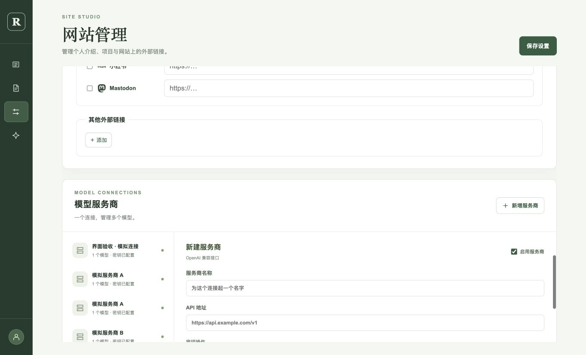
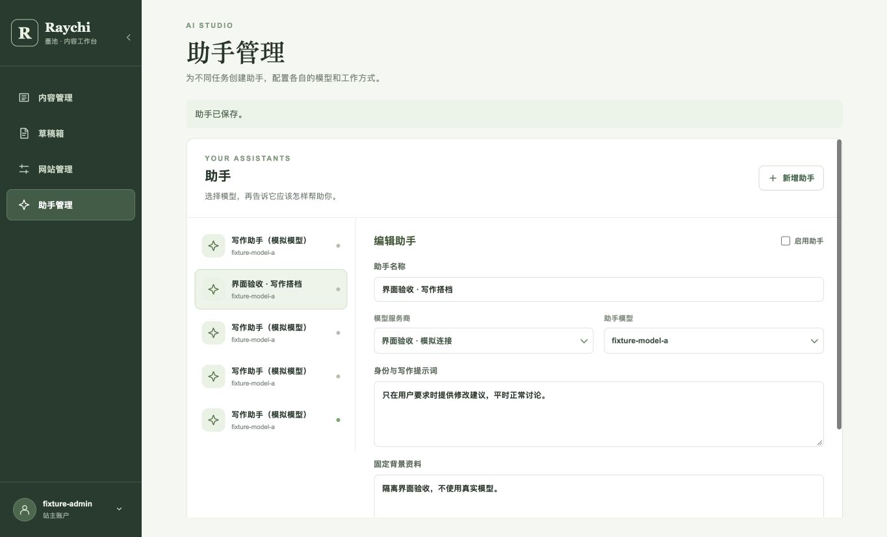
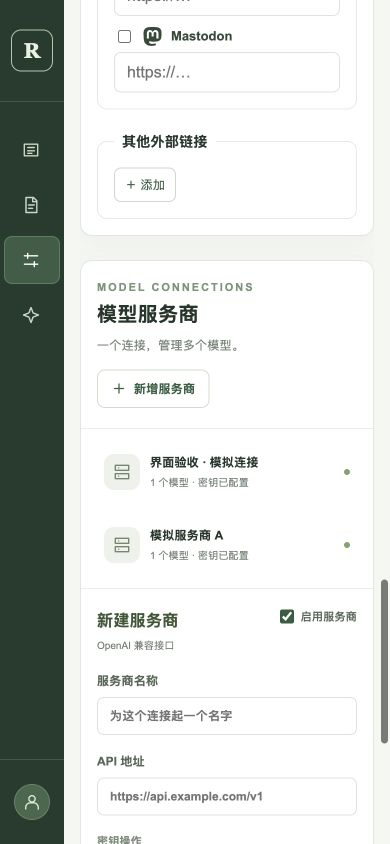

# 服务商位置与侧栏过渡验证 · 2026-10-02

[inkwell#12](https://github.com/raychi-space/inkwell/issues/12) · [PR #11](https://github.com/raychi-space/inkwell/pull/11)

本记录对应用户后续反馈，当前布局以本记录为准：助手独立页面，模型服务商位于网站管理最下方。此前上下排列的截图仅记录[前一轮验证](management-ui-2026-10-02.md)。

## 候选版本与结果

- 服务商位置与独立组件：`2ababd1ca0f35e8fdddf114f0a7ad12eb0d2280c`。
- 侧栏过渡与固定图标位置：`d29fe5bbda3849630ff7fac1f6e58ea223903d5e`。
- 沿用前一轮隔离 Java/core/MySQL 环境与本地模拟模型，没有后端/API 修改。
- Node26.7.0 下 `npm run build`、`git diff --check` 通过，只有既有编辑器包大小提示。

浏览器验证：

1. 网站设置滚动区的最后一个区块为模型服务商，位于外部链接之后；助手页面的服务商编辑区数量为 0。
2. 在服务商新模型框输入未保存文本，点击“保存设置”，输入仍保留；“保存设置”与“保存服务商”独立。随后清空临时输入，保存既有模拟服务商，聊天连接和工具测试通过（23 ms）。
3. 返回助手页面，既有助手正确读取原服务商及模型绑定，保存成功。
4. 桌面宽度在 218 与 76 间过渡，CSS 过渡为 240 ms；展开过程中实际读到中间宽度 217.765625。文字淡入淡出，收缩时隐藏文字并保留导航无障碍名称。
5. 以下位置在展开、收缩两个状态完全一致（CSS 像素）：

| 元素 | 桌面 x / y / 宽 / 高 | 手机 x / y / 宽 / 高 |
| --- | --- | --- |
| Logo | 17 / 29.5 / 42 / 42 | 11 / 29.5 / 42 / 42 |
| 首个导航图标 | 27 / 140 / 20 / 20 | 21 / 140 / 20 / 20 |
| 头像 | 20 / 766 / 36 / 36 | 14 / 784 / 36 / 36 |

6. 桌面视口高度 826，文档高度也是 826；`scrollY=0`、侧栏顶部为 0。手机 390×844 视口下网站和助手页面无横向溢出，文档宽度为 390；展开时遮罩覆盖内容，收起后保留 64 像素图标栏。模型服务商的新建表单单列显示。测试后已重置视口。

`prefers-reduced-motion: reduce` 会关闭侧栏和文字过渡；本轮浏览器在正常动画模式下验证，减少动画模式仅作代码检查。

## 截图

网站管理最下方的模型服务商：

独立助手页面：

手机服务商区域：

## 验收边界

本轮只验证位置调整、独立保存及侧栏过渡，不替代 raychi#15 的写作回归和最终 main 组合验收。未用真实模型，也未执行退出请求或配置远程头像。新建表单仅验证展示，不新增测试服务商数据；既有配置保存和模拟连接测试已实际执行。
