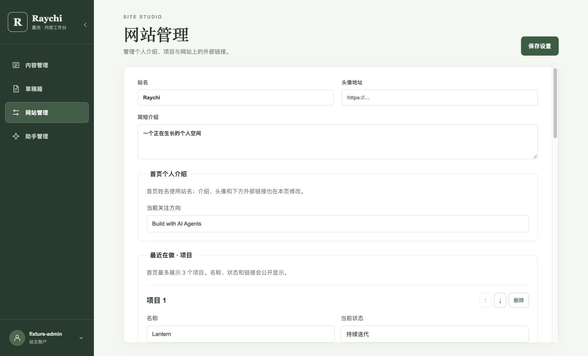
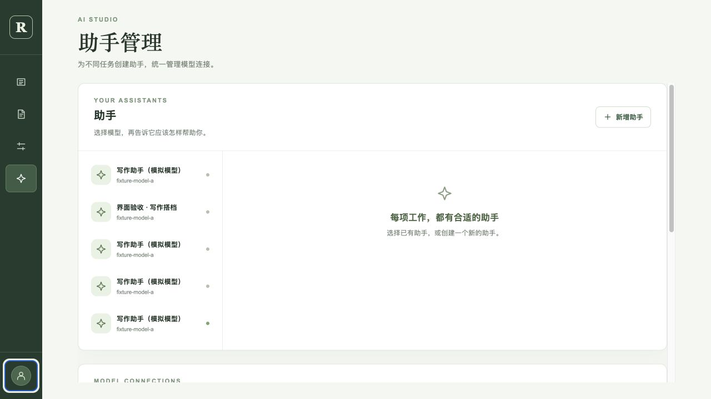
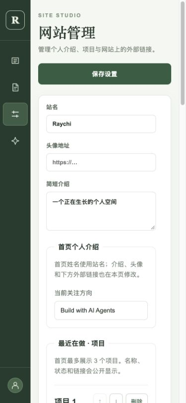

# 管理台界面候选验证 · 2026-10-02

[inkwell#12](https://github.com/raychi-space/inkwell/issues/12) · [PR #11](https://github.com/raychi-space/inkwell/pull/11) · [raychi#15](https://github.com/raychi-space/raychi/issues/15)

## 版本与环境

- 网站管理、侧栏与共享样式：`a7631ef6d3b087ac67823fe62ee948622b99cb39`。
- 助手/服务商编辑与操作说明：`3cc79993f9e615b11e5c73f5093c696d6753d6d8`。本记录和截图属于后续文档提交，不修改上述代码。
- wellspring 候选服务：`81c877e3ffd6d892b7c318c4bf9a527f6a1327b2`；agent-core 已有 main 构建 `768fea7`。
- Node.js `26.7.0`、React/Vite 开发预览、真实 Java 服务、独立 Agent 服务和隔离 MySQL 8.0 数据库；模型使用本地 OpenAI-compatible 模拟服务。
- 配置、Cookie、密钥与临时预览地址不纳入本记录。测试配置只写入隔离环境。

## 检查与实际结果

`git diff --check` 和 `npm run build` 均通过。构建只有已有的 RichEditor 大包提示。

| 路径 | 实际结果 |
| --- | --- |
| 网站管理删去多余区域 | 浏览器 DOM 中导航及两个“顺序与显示”编辑区数量为 0；保留实际展示字段并成功保存 |
| 保存兼容性 | 保存前后逐项比较 `navigation`、`homepage.recentSections`、`homepage.bottomSections`，三个隐藏配置值均保持不变 |
| 服务商新增与模型编辑 | 通过真实页面新建模拟连接；添加第二个模型后移除，保存后接口返回一个模型 |
| 连接测试 | 聊天和工具测试均通过；重新打开后默认保留密钥，再次保存与测试仍通过 |
| 助手新增与绑定 | 新建一个停用的测试助手，保存提示词、固定背景、服务商和模型；接口返回的绑定关系正确 |
| 配置切换 | 修改名称后切换，显示主题确认框；Escape 返回编辑且保留输入；放弃后切换，重开显示原保存名称 |
| 密钥边界 | 独立调用程序核对服务商查询只返回配置状态，不返回明文密钥 |
| 收缩侧栏 | 只显示 Logo、四个导航图标与头像；导航名称仍可被辅助技术读取；刷新保留收缩偏好 |
| 账户入口 | 头像菜单展示登录账户和退出按钮；Escape 关闭并将焦点返回头像 |
| 桌面滚动 | 修复隐藏状态文字撑开外层页面的问题；助手页测得文档高度与视口均为 720、`scrollY=0`、侧栏顶部为 0，内容在内部滚动 |
| 手机布局 | 390×844 视口测试网站及助手页面，文档宽度 375 不超过视口，图标栏宽 64；展开侧栏显示遮罩，表单单列；测试后已重置视口 |

独立调用程序汇总结果：

```json
{
  "settingsHiddenValuesPreserved": true,
  "providerPersisted": true,
  "assistantPersisted": true,
  "modelBinding": true,
  "queryDoesNotExposeKey": true
}
```

## 截图

网站管理（展开侧栏）：



助手管理（收缩侧栏；模型服务商位于助手区下方）：



手机网站管理：



## 范围与未覆盖项

这是本轮管理界面的候选验证，不代表整个写作助手 PR 或最终 main 组合已验收。PR #11 仍包含此前写作功能；原有跨仓验收与 main 组合复验继续由 raychi#15 跟踪。真实模型验收仍由 raychi#13 跟踪。

本轮实际验证账户菜单和键盘行为，未执行退出请求以保留当前预览会话；退出回调和会话接口沿用原实现。头像测试使用空地址的图形回退，未配置真实远程头像。未测试其他模型协议，也未增加新的后端接口或协议适配。
