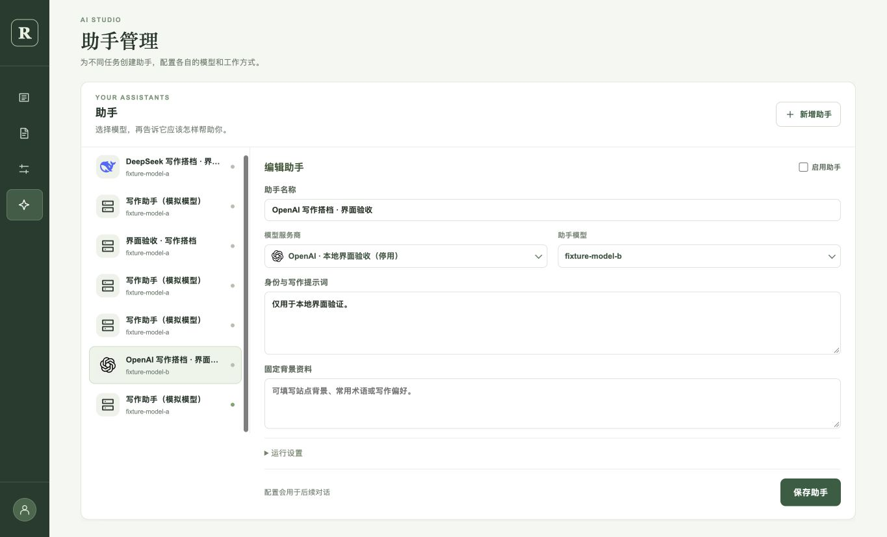
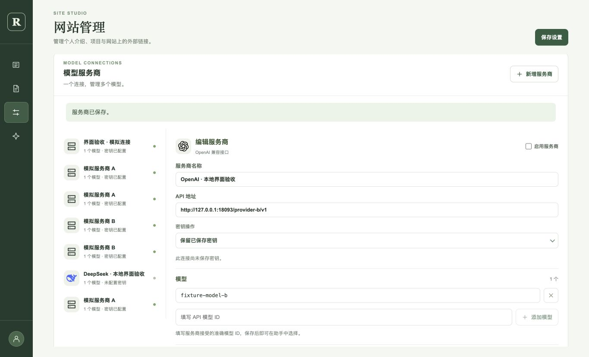
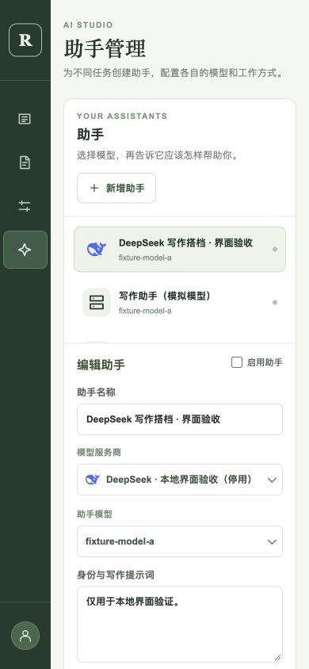

# 服务商 Logo 与管理页面密度 · 2026-10-02

[inkwell#12](https://github.com/raychi-space/inkwell/issues/12) · [PR #11](https://github.com/raychi-space/inkwell/pull/11)

## 候选版本

- 服务商图标：`6306847deea7f75d33b5e62b8976248312553212`。
- 管理页面密度：`d208f0f9ef302b43fed63ef5ea7dd33c6935f3d5`。
- 下拉框键盘滚动修复：`15a7a16d364d8ca2c27f0a5e2b29d124964e46fa`。
- 使用[上轮记录](management-refinement-2026-10-02.md)中的隔离 API/core/MySQL 环境，本轮没有接口或服务端代码变化。浏览器操作使用独立测试账户和已有本地模拟服务。

## 检查命令

Node 26.7.0 下 `npm run build`、`git diff --check` 通过；构建只有已有的编辑器分包大小提示。

使用 `node --input-type=module` 导入 `src/features/ai/providerBrand.ts` 并通过 `node:assert/strict` 检查 12 个品牌边界：OpenAI/DeepSeek 官方地址；地址优先于名称（DeepSeek 名称与 OpenRouter 地址）；仿冒后缀和路径不当作官方主机；本机连接按名称识别；多个品牌、嵌在其他英文单词中的名字、未知/非法地址和缺失连接返回通用图标；通义千问中文名称可识别；未收录的主机不会自行猜测。结果为 `PASS 12 provider brand cases`。

SVG 来自 quick-assistant-app 的本地图标目录，保留 MIT 归属说明；复制时检查不存在脚本、外链图片或 href 属性。

## 浏览器实际结果

1. 在隔离数据库保存两个停用、无密钥的本机模拟连接，名称分别包含 DeepSeek 和 OpenAI；保存两个停用的助手分别绑定连接。没有向真实模型供应商发送请求。
2. 服务商列表及编辑详情正确显示 Logo；助手列表按绑定连接显示 DeepSeek/OpenAI 图标；下拉框的选中值和选项同样带图标。检查图片 `complete=true`，未知模拟连接显示通用图标。
3. 助手保存后重新进入页面，模型和服务商绑定保持正确；品牌由接口返回的名称/地址推导，助手名称不参与品牌判断。两项新增助手和连接均保持停用，不改变自动摘要可用助手。
4. 实测发现：菜单 `scrollIntoView` 会触发停留鼠标的 `mouseenter`，覆盖方向键焦点。改用真实鼠标移动更新焦点后，复验“选择 DeepSeek → 方向键展开 → 上移 → 下移 → Enter”仍选择 DeepSeek。Home/End 可定位菜单首尾，Escape 关闭且保留原选择。编辑器中的无图标分类下拉框正常展开/关闭。
5. 桌面端内容管理、草稿箱、助手管理和编辑器标题为 30px；网站管理截图与同一规则一致。编辑器正文仍为 16px，操作按钮和分类控件正常显示；未编辑正文。
6. 手机 390×844 下助手和网站管理标题为 26px，文档宽度为 390，没有横向溢出。服务商名称、地址、模型输入实际高度均为 40px；助手列表和详情按上下排列，图标正常显示。测试后已重置视口。

## 截图

助手列表及带 Logo 的服务商选择：

网站管理中的模型服务商：

手机助手配置：

## 边界与状态

本轮完成图标和页面密度验证，继续更新原 PR #11，inkwell#12 保持待联调。未测试真实供应商连接、图片上传/发布流程或最终 main 版本组合；本记录不替代 raychi#15 的写作助手验收。自定义代理依赖管理员填写的品牌名称识别；多品牌网关或未知供应商使用通用图标。
