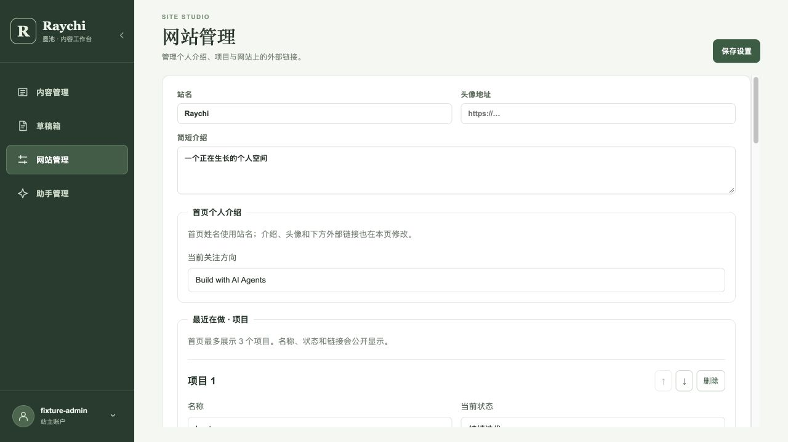

# 网站设置切换验证 · 2026-10-02

[inkwell#12](https://github.com/raychi-space/inkwell/issues/12) · [PR #11](https://github.com/raychi-space/inkwell/pull/11)

代码候选：`def4b0b36693299a1b78473d1b85aa7842387b40`。沿用前轮隔离 API/core/MySQL 环境；没有后端、数据库结构或接口变化。

## 原因与修复

SettingsEditor 原本每次挂载都将设置置为 null，先显示小加载卡片，再替换为完整设置表单，同时服务商区域位置也会改变。现在复用登录后已读取的完整设置作为初始值，再后台刷新；刷新和保存结果用本地编辑版本判断，迟到的读取不覆盖已编辑或已保存值。卸载后忽略请求结果，退出登录清除会话快照。

没有快照的首次加载使用静态表单占位，设置尚未读到时不提前显示模型服务商。加载期间保存按钮禁用。

## 实际验证

- Node26.7.0，`npm run build`、`git diff --check` 通过；只有既有编辑器大包提示。
- 正常预览“内容管理 → 网站管理”直接显示现有设置，切换后仍显示相同页面框架。
- 独立测试代理将 `GET /api/v1/admin/settings` 的响应延迟 2000ms。已有登录快照时，点击网站管理立即有表单，`.settings-placeholder` 为 false，滚动容器高度为 573.3046875px。
- 延迟刷新完成前填写“临时输入未保存”，两秒后仍保留这段输入；没有保存该测试文字。返回内容管理再进入设置，重新从数据库快照显示 Raychi，容器高度仍为 573.3046875px。
- 慢代理下重新加载浏览器、立即进入设置：没有快照时静态占位高度 550px，滚动容器高度 573.3046875px；只显示设置加载状态，不提前显示服务商。请求返回后显示完整字段。
- 隔离环境点击“保存设置”成功，仍保存 Raychi；页面显示成功状态。没有改变用户的真实公开站数据。

本轮不改变编辑器或写作执行逻辑，不替代 raychi#15 尚未完成的写作回归与 main 组合验收；PR #11 保持开放。
